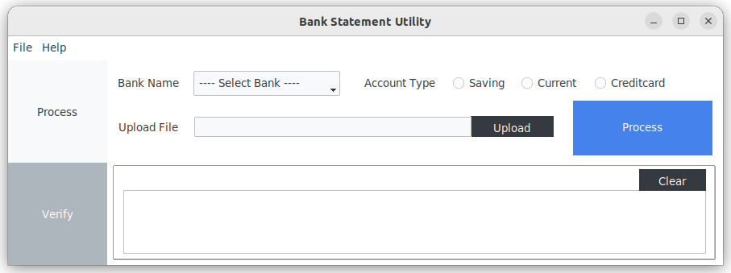
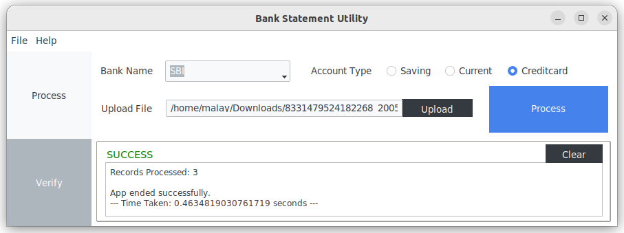
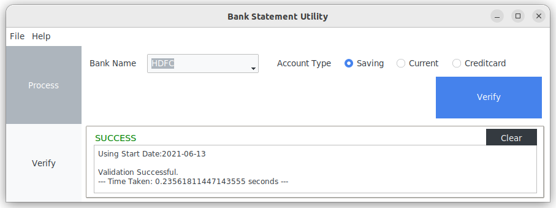

# Bank Statement Utility

<!-- buttons -->
<p>
    <a href="https://www.python.org/">
        </a> &nbsp;
    <a href="https://opensource.org/licenses/MIT">
        </a> &nbsp;
    <a href="https://github.com/MalayPalace/bank-statment-utility/commits/master">
        </a> &nbsp;
</p>

Bank-Statment-Utility developed out of my personal need to store (and process) bank statements to track expenses or to just search
specific
refund/charge/expense etc across all bank (refer supported banks below) I personally have accounts.
<br><b>SUPPORTS ONLY INDIAN BANK</b>

As a solution created this utility which can be used for dumping bank statement data to the database<i>(as of now Cassandra)</i>
which can be queried upon.

## Background

Have created various configurable parser which can read and store bank statement data to database. It is resilient against any
failure and can log the data which failed storing to database. Re-executable as in same file can be reprocessed without any
duplication issue.

Has below 2 main functionality:
1. <b>Process:</b> To process the statement file and store to the database.
2. <b>Verify:</b> Validate the transactions by comparing the closing balance between transactions. If it fails it might be some transaction might be missing. Script output will print the amount difference found.

## Screens
<p align="center">
   
   <i>App: Home Screen</i>
   <br><br>
   
   <i>App: Record Insertion with Successful message</i>
   <br><br>
   
   <i>App: Successfully Validated message</i>
</p>


## Banks which are currently supported:

Below are the format information that the utility support for various banks. Download statement as prescribed format below:

### For Saving/Current Account

| Bank Name       |      Account Type      | File Format |            Statement/Download Type             |
|-----------------|:----------------------:|:-----------:|:----------------------------------------------:|
| HDFC Bank       | Saving/Current Account |     txt     |   Download as Delimited (through Netbanking)   |
| Kotak Bank      | Saving/Current Account |     csv     | Download as CSV (Check Debit/Credit check box) |
| SBI Bank        | Saving/Current Account |     xls     |          Download in MS Excel format           |
| Bank of Baroda* | Saving/Current Account |     xls     |   Download in XLS format (Mini Statement)      |
| IDBI Bank       | Saving/Current Account |     xls     |            Download in XLS format              |
| SVC Bank        | Saving/Current Account |     xls     |            Download in XLS format              |

<i>* Have observed that Bank of Baroda changes the column format quite frequently, so might have to change config settings.</i>

### For Credit Card Statement

| Bank Name     |      Account Type      | File Format |            Statement/Download Type             |
|---------------|:----------------------:|:-----------:|:----------------------------------------------:|
| Kotak Bank**  |      Credit Card       |     pdf     |        Statement received through Email        |
| SBI Bank**    |      Credit Card       |     pdf     |        Statement received through Email        |

<i>** <u>Limitation:</u> Credit Card Statement can have duplicate scenario where it transaction can be of same amount on same date with same description and since it doesn't has closing balance, while storing to Db it will be overwritten due to non-uniqueness. Will have to handle such scenario manually. </i>

## Pre-requisite:
1. Docker & Docker-compose (for running cassandra database)
2. Python & pip

## Installation:
1. Execute docker-compose for installing and running Cassandra container 
```bash
cd Docker
docker-compose up -d
```
2. Create necessary Cassadra keyspace and table by executing ddl: `resource/cqlsh-ddl.sql`
3. Download the latest release whl file and config.ini from the Release page (https://github.com/MalayPalace/Bank-Statement-Utility/releases)
4. Install the wheel file directly:
```bash
pip install bank_statement_utility-<latest-version>-py3-none-any.whl
```
5. Utility will create Config File when it executes first time at `${HOME}/.local/share/bank-statement-app/config.ini`(For Linux & others)
   or at `${HOME}/AppData/local/bank-statement-app/config.ini`(For Windows) for Utility to read it. 
   <br><i>Manually Edit config.ini file to add Cassandra Username/password</i>

## Basic Usage:

### <u>UI Usage</u> 
Execute the `main_ui.py` from project folder or if you have installed wheel and pip install path is in your Environmental Variable then execute directly `bank_statement_utility_ui`

### <u>CLI Usage</u> 
Execute the `main.py` from project folder or if you have installed wheel and pip install path is in your Environmental Variable then execute directly `bank_statement_utility`

1. <b><u>save/process</u></b>: To process the statement file and store to the database.
   <br/><u>Usage</u>:
   ```
   python bank_statement_utility/main.py save -n {HDFC,KOTAK,SBI,BOB,IDBI} -t {Saving,Current,Creditcard} filename
   ```
2. <b><u>verify</u></b>: Validate the transactions by comparing the closing balance between transactions. If it fails it might be some transaction of debit or credit might be missing. Script output will print the amount difference found.
   <br/><u>Usage</u>:
   ```
   python bank_statement_utility/main.py verify -n {HDFC,KOTAK,SBI,BOB,IDBI} -t {Saving,Current,Creditcard}
   
   ```
   <b>OR</b><br/> can also specify `--start-from` parameter followed by date in DD-MM-YYYY format to validate transactions only between supplied date and current date.
   <br/><u>Usage</u>:
   ```
   python bank_statement_utility/main.py verify -n {HDFC,KOTAK,SBI,BOB,IDBI} -t {Saving,Current,Creditcard} --start-from DD-MM-YYYY
   
   ```
3. <b><u>export</u></b>: Export transactions in csv file sorted by lastest transaction date.
   <br/><u>Usage</u>:
   ```
   python bank_statement_utility/main.py export
   ```

## Build wheel file locally
```bash
python setup.py bdist_wheel
```

## Road Map:
Planning to add more banks and even Credit Card statements.

## Credits:
Utility is using below following dependencies.
Thanks to library creator & contributors
<p>
<a href="https://github.com/datastax/python-driver">DataStax Driver for Apache Cassandra</a><br>
<a href="https://pypi.org/project/xlrd/">xlrd</a><br>
<a href="https://pypi.org/project/pytz/">pytz</a><br>
<a href="https://pypi.org/project/pypdf/">pypdf</a><br>
<a href="https://pypi.org/project/ttkbootstrap/">ttkbootstrap</a><br>
<a href="https://pypi.org/project/tkinterdnd2/">tkinterdnd2</a><br>

Icon is by <a href="https://www.iconfinder.com/search?q=webkul+software">Webkul Software</a>
